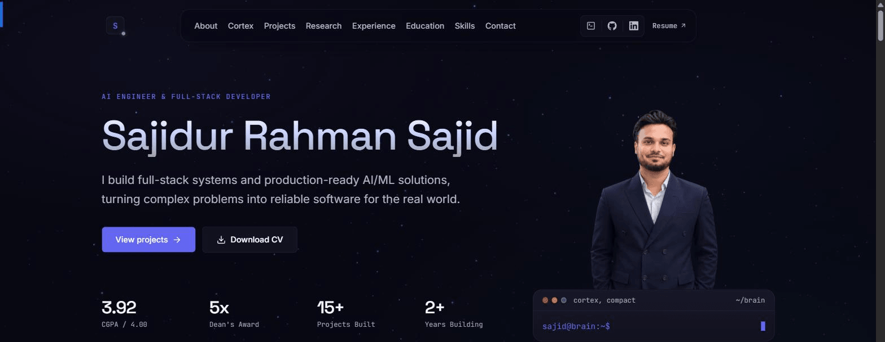

<div align="center">

# Sajidur Rahman Sajid — Portfolio

Full-stack software engineer & AI/ML developer. One-page site with searchable project/research archives, case studies, and an interactive terminal console.

[](https://sajidur-rahman-sajid.vercel.app)
[](https://nextjs.org)
[](https://react.dev)
[](https://www.typescriptlang.org)
[](https://tailwindcss.com)



</div>


## Highlights

- 🖥️ **Cortex** — a boot-sequence overlay and terminal console (`projects <slug>`, `whoami`, …) layered over the site
- 📄 In-depth case studies for flagship projects: problem, solution, architecture, trade-offs, and results
- 🔍 Searchable, filterable archives for every project and research write-up, not just the homepage highlights
- 🌍 A 3D globe on the experience section, built with `react-globe.gl` and `three.js`
- 📑 A dedicated resume page backed by structured data, with a downloadable CV

## Stack

- **Framework** — Next.js 16 (App Router), React 19, TypeScript
- **Styling** — Tailwind CSS v4 (utility-based, no config file)
- **Motion** — Motion (formerly Framer Motion)
- **Icons** — lucide-react
- **3D globe** — react-globe.gl with three.js + world-atlas (topojson)

## Getting started

```bash
npm install
npm run dev
```

Open [http://localhost:3000](http://localhost:3000).

| Script | Purpose |
| ------ | ------- |
| `npm run dev` | Development server with hot reload |
| `npm run build` | Production build |
| `npm start` | Serve the production build |
| `npm run lint` | ESLint |

## Project structure

```
app/                 Routes (App Router): /, /projects, /projects/[slug], /research, /research/[slug], /resume
components/
  home/              One-page sections (hero, about, projects, research, cortex, etc.)
  work/              Project cards, grid, case study renderer
  research/          Research cards, featured showcase, research overlay
  case-study/        ProjectOverlay used by the home page's project modal
  cortex/            "Cortex" console: the boot synapse overlay, terminal shell, and command views
  ui/                Shared primitives (Reveal, Eyebrow, MagneticButton, AnimatedMetric, …)
data/                Content: projects, research, resume, site metadata (slim + `.full` variants)
public/              Static assets: CV PDF, images (thumbnails, artwork, case-study screenshots)
```

## Content model

- **Projects** — `data/projects.ts` is the source of truth used by cards and the `/projects` grid. The home chapter renders `primaryProjects` (a curated subset) while `/projects` shows the full collection. `data/projects.full.ts` extends entries with case-study sections (`problem`, `solution`, `architecture`, `decisions`, `highlights`, `metrics`, …) rendered at `/projects/[slug]`.
- **Research** — `data/research.ts` for cards, `data/research.full.ts` for the full study pages/overlays.
- **Resume** — `data/resume.ts` feeds `/resume`; the downloadable CV lives at `public/Sajidur_Rahman_Sajid.pdf`.

## Notes

- The site is a single-page experience at `/` with additional archive pages (`/projects`, `/research`, `/resume`). Section navigation is hash-based with a tracked active state in the navbar.
- Covers live under `public/images/thumbnails/`. A project's `cover` must point to a file that exists; add the asset before marking the entry visible.

---

<div align="center">

[GitHub](https://github.com/Saji-d) · [LinkedIn](https://www.linkedin.com/in/sajidur-rahman-sajid/) · [Live Site](https://sajidur-rahman-sajid.vercel.app)

</div>
